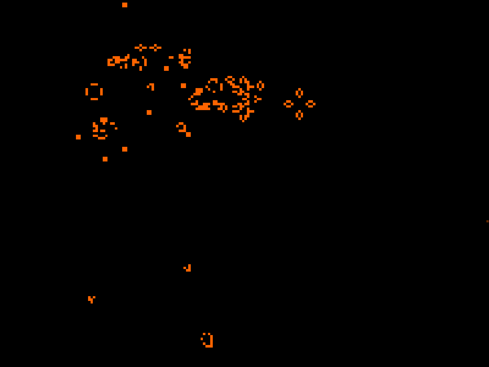

# Conway's Game of Life

The classic cellular automaton implemented in Go using SDL2.



## Controls

| Action | Key |
| --- | --- |
| Toggle cell | Mouse button |
| Start/Pause simulation | Space |
| Step a generation | Enter |
| Reset | Delete |

## Building

```sh
# Download Go-SDL2
go mod download github.com/veandco/go-sdl2/sdl

# Build
go build
```
